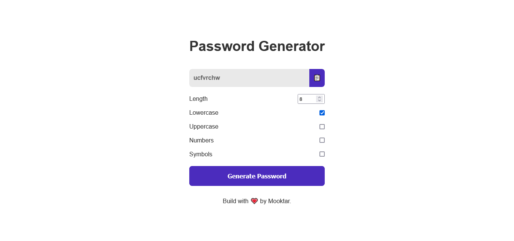

# 🔐 JS Pass Generator

## Description
A password generator with HTML5, CSS3 and JavaScript.

## Screenshot

## Live Site

[Password Generator](https://password-generator-master.vercel.app/)

## 📃 how to use
Give the length of your password and you'll get automatically a new **password**. Copy the pass generated and feel free to use it wherever you want.

## 🚀 Stack
I've using basics moderne languages as well as HTML5, CSS3 et JavaScript to build the app.

## Thanks and share it.